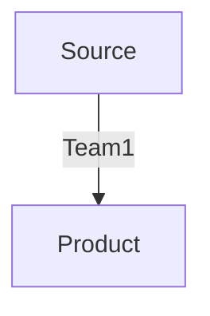
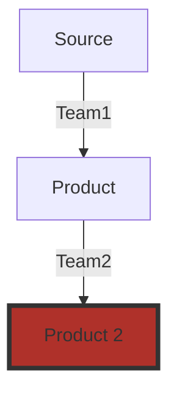

---
# You can also start simply with 'default'
theme: seriph
# random image from a curated Unsplash collection by Anthony
# like them? see https://unsplash.com/collections/94734566/slidev
background: /intro.png
# some information about your slides (markdown enabled)
title: Welcome to Slidev
info: |
  ## Slidev Starter Template
  Presentation slides for developers.

  Learn more at [Sli.dev](https://sli.dev)
# apply unocss classes to the current slide
class: text-center
# https://sli.dev/features/drawing
drawings:
  persist: false
# slide transition: https://sli.dev/guide/animations.html#slide-transitions
transition: slide-left
# enable MDC Syntax: https://sli.dev/features/mdc
mdc: true
---

# Implementing and scaling of Data Mesh while using Palantir Foundry
## a retrospective of the last 6 year journey
17.9.24 Berlin - Peter Krauß-Hohl

---
transition: fade-out
class: text-center
---
 
 

## Let me tell you a story

 
 

## The year is 2018 and we are in Berlin. 
 
 

## More precisely in the office of Axel Springer National Media&Tech.

<!--
You can have `style` tag in markdown to override the style for the current page.
Learn more: https://sli.dev/features/slide-scope-style
-->

<!--
Here is another comment.
-->

---
layout: image-right
image: /eliza.png
---

# Our Protagonist

Our protagonist in this story is Eliza (name is fictitious). She is a Data Scientist (PhD in statistics and really good with Pandas, ScikitLearn and ML models in general)
 
 
Her task is to figure out in the massive data set that is describing the behavioral data of germanies biggest newspaper, the most relevant features that are responsible to keep a user in the subscription.
 
 
She was super exited - and noodling on the problem - which could be the right ml model to approach it? Maybe some easy linear regression or should she go for the guns and try something really fancy with deep learning?
 
 

---
layout: image-right
image: /eliza_equations.png
---

# How?
 
 

Well let`s burn that bridge when we crossed it and start with something easy - __get the data and start to make my hands dirty!__

But wait, __how do I get the data?__ I don't have access to the oracle cluster that all the raw events that I definitely need are stored...

Hmmm, can't be so hard to get access, let's figure out who is responsible and can give me access.

---
layout: image-right
image: /guenther.png
---

# Günther - PO central DWH

Günther is no villain -  he would love to help but...

- There are analytical request from all parts of the org 
- the data quality is - let's say questionable
- dwh conssts of 2500 tables, without documentation and inconsistent naming (mapping tables from id_a -> id_b)
- the developer retention is 6 months
- he is PO number 15 in 2 years

<small> -> Eliza is sending requests that she needs the raw data and maybe a bit of documentation to understand it.... which simply does not exist in the whole org...
</small> 

---
layout: image-right
image: /peter_cartoon.png
---

# Peter
We need a Data Lake

Our next actor in this story is entering the stage - let's call him
Peter - yes that is really his name -
and he got the task from his boss to build up a data lake infrastructure that allows the storage and work with vast amounts of data - and after speaking with Eliza, he realized that 

<v-click>

__Time to data__ -> is the crucial KPI to work on.

</v-click>

---
layout: image-right
image: /foundry.png
---

# Palantir Foundry
 
Luckily we had the possibility to introduce Foundry from the company Palantir quite fast in our org and by following a few simple rules (which were hard to maintain), we managed to build up an environment in which every employ who get's her login to our Single-Sign on has immediate access to all the data and access to a quite powerful tool-set to work with it

---
theme: seriph
layout: image-right
image: /rules.png
---

# Rules

1. only sources that we know already that we need are allowed to be connected to the Data Lake
2. everyone gets reading access to everything
3. __no dependencies__ <- copy it and build your own pipeline 
 
 
 
 
 
<v-click>
-> Hey, wait sounds nice - but wasn't this talk about Data Mesh???
</v-click>

---
theme: seriph
---

# Let's jump some years into the future!

  <iframe width="560" height="315" src="https://www.youtube.com/embed/IIl8y89gGJM?si=Iy0dWcL_YqOyFLgD" title="YouTube video player" frameborder="0" allow="accelerometer; autoplay; clipboard-write; encrypted-media; gyroscope; picture-in-<picture>; " referrerpolicy="strict-origin-when-cross-origin" allowfullscreen></iframe>

---
theme: seriph
---

# Do you remember rule #3 
3. __no dependencies__ <- copy it and build your own pipeline 

Well this caused some interesting things - on one hand it worked brilliantly - the teams were super fast. They had everything that they needed and build one feature after the other and created really interesting Data Sets inside Foundry, which were - based on rule #2 - accessible to everyone. There were stuff like the "Reading Interest" or "Trend Score" which was so good, that other teams decided to "try out something" on top of that data sets. Of course the corresponding teams did not speak with each other, because it was not needed and the consuming team - just wanted to "try out something"

---

# Nothing lasts as long as a temporary solution

So, here we are with the most tricky dependency that you could imagine - because we were not even aware of it and what happens always if there is something like this - you realize it because it brakes

---
layout: image-right
image: /super_hero.png
---

# Data Mesh for the rescue
Like in the discusion about Micro Services or a monolithic structure - this is just about scaling the service that you are working on to many people and therefore the Data Mesh approach offers some tooling

---
theme: seriph
---

# Core Ideas of Data Mesh

- Decentralized teams and data ownership

- Data Products powered by Domain Driven Design

- Self-serve Shared Data Infrastructure

- Global federated Governance

[Zhamak Dehghani](https://martinfowler.com/articles/data-mesh-principles.html)
[Book - Data Mesh](https://martinfowler.com/articles/data-mesh-principles.html)---

---
theme: seriph
---

# Data Products powered by Domain Driven Design

- **Discoverable**
  - <small>Set of meta information to allow the automatic registration in a central registry.</small>

<v-click>

- **Understandable**
  - The specific meaning of coherent data - what kind of entities and the relationships between them

</v-click>

<v-click>  

- **Addressable**
  - A data product offers a permanent and unique address to allow the user or system to access it.
  
</v-click>

<v-click>

- **Natively Accessible**
  - It can be accessed by different personas - scientist (SQL), engineers (API) , analyst(Spreadsheet or SQL)

</v-click>

<v-click>

- **Secure**
  - Encryption, Access Control, Data retention, Regulations, Confidentially Levels

</v-click>

<v-click>

- **Trustworthy**
  - Interval of Change, Timeliness Completeness, Stat shape of data, precision&accuracy over time

</v-click>

<v-click>

- **Interoperable**
  - Type (explicitly defined types), polysemes identifiers, global adress, linking and reuse schema, data linking,

</v-click>

<v-click>

- **Valuable on its own**
  - No need to add more to be generate value

</v-click>

---
layout: full
---

# What does this mean for us

- Luckily Foundry is dealing with some points
- Only Data sets that are listed in the data catalogue can be used from others
- If you build something on top of a data set by someone else - tell them!
- The lineage must be documented

---
layout: statement
---

# Data Mesh or Central Data Team?

50 shades of grey -> there is no binary answer. 

If your data product is mature enough that others wanna use it - it makes sense to build as a product - not before! It is quite some effort to maintain it and define an interface.

---
layout: end
class: text-center
---

# Thank You

### Thats me

[Blog](https://pkrauss-hohl.site) · [GitHub](https://github.com/raven-rwho) · [Linkedin](https://www.linkedin.com/in/kraussdevelopment/)

<PoweredBySlidev mt-10 />

---
layout: center
class: text-center
---

# Questions?

---
layout: image-right
image: /eliza.png
---

# A question that you might have
What happened to Eliza?

<v-click>
She worked on several ML based products and was a core contributer to our dynamic pricing intiative - the churn use-case that she started with was ended quite soon...
</v-click>